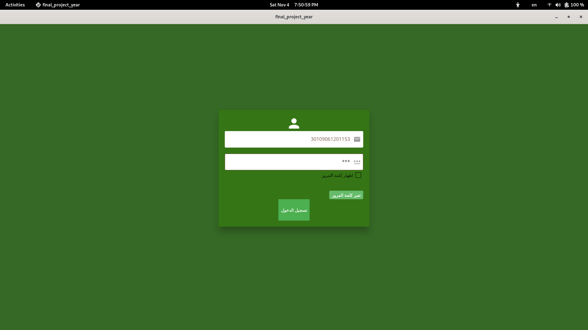
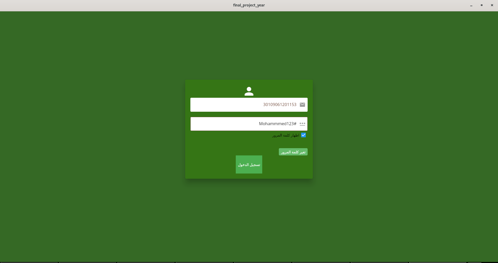

./videos/Screencast%20from%202023-10-20%2016-44-30.webm
# digitalization Live Stock

##  prerequisites
    - python
    - django
    - mysql
    - typesense
    - redis
## steps to run the project 
    - enter the folder final_project_backend/
    - run command `python -m pip install -r requirements.txt`
    - run command `python manage.py makemigrations``
    - run command `python manage.py migrate`
    - run file `database/event.sql`
    - run command `python database/typesense_script_schema.py`
    - run file `final_project_backend/auto_insert_to_model.py`
# Images Screen

